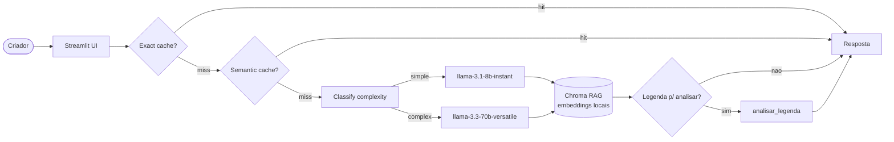

# 🎬 Assistente do Criador de Conteúdo

> Q&A para criadores de conteúdo (foco em **saúde & bem-estar**) sobre **publicidade,
> alegações de saúde, direitos autorais e LGPD** — com a fonte citada e uma ferramenta
> que analisa legendas de posts.

<!-- TODO: cole aqui o GIF de demo (10-15s, <5MB) — peek/terminalizer/OBS -->

**Live demo:** _TODO — cole o link do Streamlit Cloud após o deploy_

---

## Problem statement

1. **Qual problema resolve?** Criadores de conteúdo — principalmente de nutrição, estética,
   medicina e bem-estar — vivem com dúvidas de risco real: *preciso marcar #publi se recebi
   o produto de graça? posso postar antes/depois de cliente? posso usar essa música no Reels?
   que dados posso pedir num sorteio?* Errar isso gera punição de conselho, processo ou post
   derrubado.
2. **Para quem?** Criadores e social media que produzem conteúdo nessas áreas e não têm um
   jurídico por perto.
3. **Por que LLM + RAG + tool-use (e não busca simples)?** As respostas precisam ser
   **fundamentadas num guia** (não inventadas) e **citar a fonte**; uma busca por palavra-chave
   não responde "posso falar X?" em linguagem natural. E a **tool** dá um valor determinístico
   que o LLM sozinho erra (contar caracteres, detectar se a legenda tem #publi).

## Arquitetura



- **LLM:** Groq (endpoint OpenAI-compatible). Routing escolhe `8b-instant` (barato) p/ perguntas
  simples e `70b-versatile` (premium) p/ perguntas que pedem raciocínio.
- **Embeddings:** `sentence-transformers` **locais** — Groq não expõe `/v1/embeddings`. Modelo
  **multilíngue** porque o corpus é PT-BR.
- **Vector store:** Chroma local persistente.
- **Tool-use:** `analisar_legenda` chamada via function-calling quando o usuário cola uma legenda.

## Setup

```bash
# 1. Dependências
uv venv && source .venv/bin/activate
uv sync                       # ou: pip install -e .

# 2. Chave (Groq)
cp .env.example .env          # edite e cole sua GROQ_API_KEY (https://console.groq.com/keys)

# 3. Instalar todas as dependências
pip install -e .

# 4. Rodar local (o 1º run baixa o modelo de embeddings e indexa o corpus)
streamlit run src/ui/streamlit_app.py
```

Testes (rodam sem chave; o de integração pula se não houver `GROQ_API_KEY`):

```bash
pytest -q
```

Deploy no **Streamlit Cloud**: aponte para `src/ui/streamlit_app.py` e ponha `GROQ_API_KEY`
(e os `*_MODEL`) em **Settings → Secrets** (veja `.streamlit/secrets.toml.example`).

## Cost & Latency

Gere os seus números com `python scripts/bench.py` (mede baseline vs cache vs routing).
Exemplo ilustrativo (8 queries, com repetição/paráfrase para exercitar o cache):

| Estratégia | Custo total | Redução | Cache hits |
|---|---:|---:|---:|
| Baseline (premium sempre) | $0.00609 | — | 0/8 |
| + Exact + Semantic cache | $0.00542 | ~11% | 1/8 |
| **+ Routing cheap-first** | **$0.00119** | **~80%** | 1/8 |

> Substitua pelos números reais do `bench.py`. Custo estimado pela tabela de preços da Groq
> (input/output por 1M tokens). Meta da rubrica (banda "Excelente"): **≥50% de redução**.

## Design decisions

- **Embedding multilíngue (`paraphrase-multilingual-MiniLM-L12-v2`), não o `all-MiniLM-L6-v2`.**
  No Lab 4 vi o `all-MiniLM` (inglês) afundar a `context_precision` com queries em PT-BR. Como o
  corpus é todo em português, um modelo multilíngue casa muito melhor query↔documento.
- **Embeddings locais.** A Groq só faz chat/STT, não embeddings; rodar `sentence-transformers`
  local resolve, zera custo de embedding e ainda funciona offline depois do 1º download.
- **Routing cheap-first.** A maioria das perguntas é factual e curta → `8b-instant` (10× mais
  barato) resolve; só perguntas com "explique/compare/estratégia" vão pro `70b`.
- **Tool determinística (`analisar_legenda`).** Contagem de caracteres e detecção de #publi/CTA
  são tarefas que o LLM erra por palpite; uma função Python dá resultado exato e auditável.
- **`chunk_size=800/overlap=100`.** Padrão do M2; preserva conceitos explicados em várias frases
  (vi no Lab 4 que `chunk=200` fragmenta e derruba faithfulness).

## Limitations

- O corpus é um **guia educativo autoral** (~15 págs equivalentes), não a íntegra de CONAR/LGPD;
  a performance degrada para perguntas fora do escopo do guia.
- Free tier da Groq tem teto de tokens/dia (TPD) — uso intenso pode bater 429; o routing
  cheap-first e o cache mitigam, mas não eliminam.
- **Não é aconselhamento jurídico/médico.** É um apoio educativo; casos reais exigem profissional.
- A demo usa corpus fixo (não há upload de PDF pelo usuário na UI).

## Tech stack

- **LLM:** Groq — `llama-3.3-70b-versatile` (premium) / `llama-3.1-8b-instant` (cheap)
- **Embeddings:** `sentence-transformers` local — `paraphrase-multilingual-MiniLM-L12-v2`
- **Vector store:** Chroma (persistente local)
- **UI:** Streamlit · **Observability:** structured logs com `trace_id` (Langfuse opcional)
- **Deploy:** Streamlit Community Cloud

## Estrutura

```
projeto-portfolio/
├── data/corpus/guia-criadores-conteudo.md   # corpus autoral (troque pelo seu)
├── src/
│   ├── ui/streamlit_app.py                   # UI + orquestração (cache→routing→RAG+tool)
│   ├── pipeline/
│   │   ├── rag.py        # TODO 1-3: ingest/index, retrieve, answer (+ answer_with_tools)
│   │   ├── tools.py      # TODO 4: analisar_legenda (function-calling)
│   │   ├── cache.py      # TODO 5: SemanticCache (embeddings locais)
│   │   └── routing.py    # TODO 6: classify_complexity (cheap-first)
│   └── observability/trace.py                # logging estruturado
├── scripts/bench.py                          # custo/latência p/ a tabela acima
├── tests/test_smoke.py                       # smoke tests (sem rede) + integração (skip s/ key)
├── docs/observability.md
├── pyproject.toml · .env.example · .gitignore
└── README.md
```

## Status dos 6 TODOs

| TODO | Arquivo | Status |
|---|---|---|
| 1 | `rag.py::ingest_and_index` | ✅ (lê .md/.txt/.pdf, chunk 800/100, indexa) |
| 2 | `rag.py::retrieve` | ✅ |
| 3 | `rag.py::answer` | ✅ (+ `answer_with_tools` com function-calling) |
| 4 | `tools.py::analisar_legenda` | ✅ |
| 5 | `cache.py::SemanticCache.get` | ✅ (embeddings locais) |
| 6 | `routing.py::classify_complexity` | ✅ (cheap-first) |

---

*Disciplina "Desenvolvendo Software com IA Generativa" (Mod4 PPI) — Modalidade A.*
